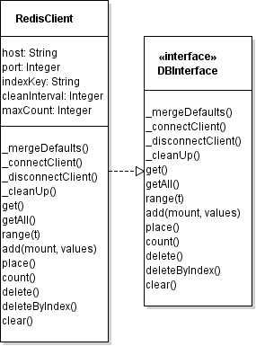

<https://github.com/fooloomanzoo/webvisual>

# Motivation

Eine Visualisierung von Messdaten von Messgeräten bietet Anwendern die Möglichkeit, über eine Browseroberfläche Messwerte in Echtzeit zu überwachen. Dies gibt den Vorteil, einen schnellen Eindruck über den Zustand von Experimenten oder Messzuständen zu gewinnen. Das Projekt findet Anwendung in der Überwachung einer Gaswarnanlage und einer Tieftemperaturmessanlage, in denen in verschiedenen Laboren bestimmte Geräte sequentiell Messdaten verschiedenartige Daten aufnehmen. So nimmt zum Beispiel die Gaswarnanlage nur Alarmzustände war, die durch die Konzentration von Gasen in den entsprechenden Laborräumen ausgelöst werden, und die Tieftemperaturmessanlage an ihren Geräten direkte physikalische Messgrößen wie Temperatur und Druck auf. Für die Umsetzung des Projekts ist die Zuordnung der Eigenschaften in der Darstellung und die Aufnahme der Messwerte elementar für die Visualisierung und die Datenerfassung. Des weiteren ist die Erreichbarkeit der Visualisierung ein zentraler Punkt. Zum einen muss der Server stets verfügbar sein. Fehlerhafte Messwerte oder Messdateien dürfen die Prozesse nicht unterbrechen oder terminieren. Der Server muss über sehr lange Zeiträume laufen, da die Prozesse gegebenenfalls nicht direkt gewartet werden, und es für Anwender der Webplattform eventuell nicht ersichtlich ist, ob die Verarbeitungsprozesse funktionstüchtig sind, da die Bereitstellung der Webseite tadellos durchgeführt werden kann, aber durch einen serverinternen Fehler die Auswertung unterbrochen sein könnte. Auch soll ein Administrator die Möglichkeit haben, im laufenden Prozess Bezeichnungen, Zuordnungen und auch Servereinstellungen ändern zu können, ohne dass der Server ausfällt. Der Server muss sich daher zum Teil selbstständig verwalten können, das heißt dass sich Prozesse ausreichend gegen fehlerhafte Konfigurationen und Messdaten abgesichert sein sollen, gegebenenfalls auf Backups und Defaultwerte zurückgreifen, sich bei Ausnahmefehlern auch zurücksetzen und Unterprozesse selbstständig neu starten können. Hierfür bietet die verwendete Node.js-Plattform eine gute Grundlage, da man in der Lage ist einzelne Prozesse auslagern und untergliedern zu können, eine Interprozesskommunikation auszuführen und ein stabile Fehlerüberwachung durchzusetzen kann. Ein weiterer wichtiger Punkt der Erreichbarkeit ist die Plattform, mittels welcher ein Benutzer die Visualisierung anzeigen wird. Die Hardwareplattformen sind in diesem Fall stationäre PCs und Geräte, auf denen Betriebssystem laufen, die für die mobile Benutzung, wie _Android_, konzipiert sind. Als Softwareplattform sind Browser vorgesehen, die ausreichend aktualisiert und sicher sind, in diesem Fall _Firefox_ ab Version 38, _Chrome_ ab Version 41, _Opera_ ab Version 28 und _Internet Explorer_ ab Version 11, also Browserversionen ab Mitte 2015\. _Safari_ ist aufgrund fehlender Geräteverfügbarkeiten in den Instituten nicht testbar und erforderlich, auch da Apple die Weiterentwicklung von Safari auf Linux- und Windows-Systemen seit 2012 nicht fortführt. Die Stabilität des Codes stellt eine große Herausforderung dar, weil sich die verschiedenen Browseranbieter trotz eines vorhandenen Standardisierungsgremiums für Javascript und HTML (_World Wide Web Consortium_) zum einen unterschiedliche Ansätze in der Implementierung der Standards nutzen, was zu unterschiedlichem Verhalten der Webseitendarstellung führt, und zum anderen Standards nicht oder stark verzögert implementieren, wie zum Beispiel die -Funktionen und _class_-Implementierung des -Standards oder die Implementierung sämtlicher _input-types_ des -Standards, wie zum Beispiel _date_. Die Herstellung eines möglichst kompatiblen Codes ist daher eine wichtige Aufgabe der Erzeugung einer Webseite, was durch die Verwendung eines älteren, bereits allgemein implementierten Standards erreicht werden kann oder durch die Verwendung von sogenannten -Bibliotheken. Die Geschwindigkeit, mit der sich die Visualisierung auf dem Anwendergerät aufbauen kann, ist ein auch ein Kriterium der Erreichbarkeit. Zum einen ist die Verbindung zum Gerät zu berücksichtigen, da sich ein Gerät, dass über den Mobilfunk eine Verbindung zum Server aufbaut, mit starken Latenzen und Bandbreiteneinschränkungen unterliegen kann. Es kann ein Ansatz in modernen Browsern sein, Offlinecaches anzulegen, die neben dem schon vorhandenem Browsercache, sogenannte Appcaches erzeugen, die es ermöglicht verschiedene Ressourcen dauerhaft zu speichern, um den Aufbau von Webseiten zu beschleunigen, da diese Ressourcen nicht doppelt abgefragt werden müssen. Dies gilt allerdings nur bedingt für Messdaten, da diese auf Konsistenz und Lückenhaftigkeit überprüft werden müssten, was leistungsschwächere Geräte überfordern könnte. Auch können modernere Möglichkeiten durch die Verwendung von Möglichkeiten eröffnen, Inhalte schneller zu übertragen. Da die Messwerte permanent aktualisiert werden können, muss eine persistente Verbindung mit den Benutzergeräten hergestellt sein, damit die Darstellung mit den Geräten aktualisiert werden können, was vor allem im Fall der Gaswarnanlage wichtig ist. Dies lässt sich durch die Verbindung mit Websockets realisieren. Das genutzte Serversystem der Visualisierung war vor der Umsetzung der Seminararbeit in dem Zustand, Messdateien überwachen und verarbeiten zu können, aus Konfigurationsdateien serverseitig über eine Jade-Template-Umsetzung eine Webseite generieren zu können, die ein Benutzer nach einer Authentifizierung über einen _LDAP_-Server abrufen und über eine Websocketimplementierung aktualisiert werden konnte. Dazu wurden auch Vorteile eines clientseitigen Templatemodels (_polymer_) ausgenutzt. Dies führte nur teilweise zu einer guten Verfügbarkeit und Geschwindigkeit, vor allem nur eingeschränkt auf mobilen Plattformen. Das Ziel der Seminararbeit ist es, die Verfügbarkeit zu verbessern, den Webseitenaufbau zu erhöhen, bereits empfangene Ressourcen offline verfügbar zu machen, Datenbankabfragen für vergangene Messdaten einzuführen, Authentifizierungsrichtlinien der Messdaten weiterhin zu gewährleisten, die Webseite über _HTTP/2_ bereitzustellen und die Kompatibilität zu erhöhen.

# Grundlagen

## Server

### Node.js

[Node.js] stellt eine Serverengine dar, die den Betrieb von Netzwerkanwendungen ermöglicht und insbesondere zur Realisation von Webservern geeignet ist. Es basiert auf der V8 [Javascript] Engine, welche in C geschrieben ist und auf der Javascript-Engine _V8_ basiert, die von Google für das _chromium_-Project entwickelt wird. Die Architektur von node.js ist ereignisgesteuert. Das heißt, dass sämtliche Ereignisse in eine eingereiht Eventloop werden, wo sie auf ihre Verarbeitung warten. Es können auch node-Prozesse durch einen Hauptprozess initiiert werden, als sogenannte _child_-Prozesse, die über eine Interprozesskommunikation (IPC) gesteuert werden können. Eine solche Architektur erlaubt Node.js eine Blockierung des Prozesses zu verhindern. Die potenziell blockierende Funktionen (z.B. Benutzerabfragen) können als Argument eine Callback-Funktion erhalten, die alle nötigen Ergebnisse von der Funktion bekommt und in die eingereiht wird. Es macht das asynchrone Abarbeiten von Ereignissen ohne Multithreading möglich, was zu einer hohen Speichereffizienz führt. In den Grundeinstellungen haben node.js Prozesse eine begrenzte Verfügbarkeit an [Arbeitsspeicher][^3], welche sich allerdings erweitern lässt [Node.js] unterstützt alle gängigen Betriebssysteme (Windows, Linux und Mac OS) und wird über die Kommandozeile bedient. Es existieren auch Derivate, die es ermöglichen, Grafische Serveroberflächen zu erzeugen, wie z.B. [electron], welches auch in diesem Projekt eingesetzt wurde, um grundlegende Serverkonfigurationen erleichternd durchzuführen. Um eine Applikation auszuführen, wird eine Datei mit auszuführenden Code an Node.js übergeben. Vorherige Kompilierung ist nicht notwendig, da sich JavaScript um eine -Sprache handelt.

### Module von Node.js

Node.js verfügt über ein vielfältiges Modulsystem, das lauffähige Skripte und Erweiterungen in den Code integrieren kann, zum Beispiel in dem sie über den Paketmanager _npm_ installieren werden. Ebenso sind verschiedene Grundfunktionen modularisiert implementiert, wie zum Beispiel die Netzwerkkommunikation _net_, der vereinfachte Serveraufbau mittels _express_ und das Dateisystem über _fs_. Es ist möglich Module nicht nur in Javascript zu schreiben, sondern auch in Python und C++, sofern man plattformspezifisch entsprechende Compiler beziehungsweise Interpreter installiert hat, um die Module dann für die Plattform kompilieren beziehungsweise ausführen zu können. Ein Beispiel, welches eine HTTP-Anfrage darstellt:

```javascript
// Lade geeignetes Modul
var http = require('http');
var port = 3000;

// Erzeuge einen HTTP-Server
var server = http.createServer(function (request, response) {
  response.writeHead(200, {"Content-Type": "text/plain"});
  response.end("Meine Internetseite\n");
});

// Starte den Server
server.listen(port);

// Ausgabe in der Konsole, Fehlerbehandlung
server.on('error', (err) => {
  if (err.code === 'EADDRINUSE') {
    console.warn( `HTTP Server \n Port ${port} in use. Please check if node.exe is not already running on this port.` );
    server.close();
  } else if (err.code === 'EACCES') {
    console.warn( `HTTP Server \n Network not accessable. Port ${portt} might be in use by another application. Try to switch the port or quit the application, which is using this port` );
  } else {
    console.error(err);
  }
})
  .once('listening', () => {
    console.log( `HTTP Server is listening on port ${port}` );
  });
```

### HTTP/2

[HTTP/2], kurz auch _H2_, ist eine Weiterentwicklung des Netzwerkprotokolls HTTP 1.1 und ist von dem Projekt _SPDY_ ausgegangen. Es gibt einige Unterschiede zu HTTP 1.1, wie z.B.:

- die Reihenfolge, mit der das Paket bzw. ihre Teile den Empfänger erreichen, sind nicht mehr zwingend

- der Header kann selbst komprimiert versendet werden

- binär-codierte Inhalte können direkt übertragen werden

- die Daten können aufgeteilt versendet werden (_multiplex_)

- Server können Datenübertragungen initiieren (_push_-Verfahren)

- Die Verbindung ist zwingend verschlüsselt

Die Möglichkeit durch den Server Verbindungen zu initiieren, ermöglichen vielfältige Optionen, den Aufbau einer Webseite zu beschleunigen, in dem beispielsweise Skripte von den bekannt ist, dass der Client sie zur Darstellung initial benötigt, auf die initiale Anfrage versendet werden. Auch ist das _Multiplexing_ der gesendeten Dateien ein Vorteil gegenüber HTTP 1.1.

### Redis

[Redis] ist ein eigenständiges serverseitiges Datenbanksystem für verschiedene Plattformen mit einer einfachen Schlüssel-Werte-Datenstruktur und ist Teil der Familie der _NoSQL_-Datenbanken. Es ist eher für einfachere als für komplexe Datenstrukturen geeignet. Für sequentielle Daten kann man _Redis_ verwenden, wenn man die Datenstrukturen abflachen kann, zum Beispiel in sortierten Listen mittels _ZADD_. Redis gilt als sehr performant. Es existieren diverse Implementierungen für verschiedene Umgebungen, ebenso für [node.js][^6] Die direkte Kommunikation über das HTTP-Protokoll ist auch möglich.

### Websockets

Um Aktualisierungen auf der Webseite zu propagieren, werden Websockets in der Implementierung von [socket.io] benutzt. Diese ermöglicht verschiedene Namespaces, die Verschlüsselung der Verbindung und das automatische komprimieren und entpacken der Datenpakete. Die allgemeine Vorgehensweise von Websockets geht in folgenden Schritten von statten:

- ein Client sendet _handshake request_

- der Server authentifiziert den Client (anhand des _headers_) und sendet einen _response_

- Wiederholung der Abfrage in Intervallen (_polling_).

Mithilfe von Websockets werden die Informationen zwischen Client und Server möglichst in Echtzeit ausgetauscht, da es das oben erwähnte -System benutzt und für diesen Zweck parallel zur HTTP-Anfrage des Browsers eine weitere Verbindung zum Server herstellt, die permanent für die gesamte Dauer des Seitenbesuchs bestehen bleibt. Oft benutzen Browser eine eigene Implementierung von Transportschichten, weshalb hier das Modul _socket.io_ benutzt wird. Dieses Modul stellt eine Art von dar und verwendet die Transportmethoden, die im aktuellen Browser vorhanden sind. Socket.io wird sowohl auf der Server- wie auch auf der Clientseite ausgeführt. Ein Beispiel für das Senden von Server zum Client ist wie folgt:

```javascript
// Empfange neue Daten
var newdata = getData();

// Sende die Daten zum Client
socket.emit('data', newdata);
```

Entsprechender Empfang der Daten auf der Clientseite:

```javascript
// Ein Listener für die Daten
socket.on('data', function(newdata) {
  processData(newdata);
});
```

## Client

### Polyfills

Ein Polyfill ist ein Code-Baustein, der eine nicht unterstützte Funktion mittels eines Workarounds verfügbar macht. Prinzipiell muss sich das nicht auf Browser beschränken, da man teilweise auch für ältere node.js-Distributionen polyfills benötigt, um eine bestimmte Funktionalität zu erreichen.

### D3.js

[d3.js] ist ein Framework, mit dem sich erleichtert Vektorgrafik-Elemente (_svg_) DOM-Elemente erzeugen lassen. In _d3.js_ sind vielfältige Interpolationsfunktionen und Darstellungsmöglichkeiten von zeitlichen Werten integriert. Es eignet sich vor allem für die Erzeugung von Diagrammen, wofür es hier auch benutzt wird, aber auch für die Darstellung von Raumplänen.

### Polymer

[polymer] ist ein Client-Template-Framework, mit dem man innerhalb der DOM erleichtert neue Objekte erzeugen kann, Attribute setzen, Daten verknüpfen und einfacher Events erzeugen kann. Es basiert auf dem Konzept von _webcomponents_, einer Weiterentwicklung von _angular.js_, und es ermöglicht eigene HTML-Elemente zu definieren. Dazu wird eine definierte Vorlage (_Template_) benutzt, um ein entsprechendes Abbild in der DOM zu erzeugen. Einige Browser unterstützen dieses Modell auch nativ, und in diesem Fall wird eine sogenannte _Shadow-DOM_ um das _Template_ erzeugt, dass dieses Element vor dem Zugriff von außen isoliert und eine eigene Stilisierungsumgebung für _css_ erzeugt. Für andere Browser unterstützt _polymer_ eine -Bibliothek.

```html
<dom-module id="example-element">
  <template>
    <style>
      /* css-Stilisierung */
      :host {
        display: inline-block;
      }
    </style>
    <!-- lokale DOM -->
    <span>Beispiel</span>
  </template>
  <script>
    Polymer({
      /* Prototyp (polymer 1.7)*/
      is: 'example-element',
      properties: {
        info: String
      }
    });
  </script>
</dom-module>

<!doctype html>
<html>
  <head>
    <meta charset="utf-8">
    <link rel="import" href="/polymer.html">
    <link rel="import" href="/example-element.html">
  </head>

  <body>
    <example-element id="e1" info="test"></example-element>
    <example-element id="e2" info="test2"></example-element>
  </body>
</html>
```

### Webworker

Ein [Webworker] ist ein ausgeführtes Skript in Javascript, das in einem separatem _Thread_ läuft, und so den Hauptprozess nicht blockiert. Die Kommunikation findet über einen _Messaging_-Prozess statt. Es existieren neben dem Standard-_Webworker_ verschiedene Arten von _Webworkern_, die erweiterte Möglichkeiten bieten, wie zum Beispiel der [Service Worker][] oder der _Shared-Worker_. Der _Service-Worker_ ermöglicht es (nur bei einer gesicherten, authentifizierten Verbindung) sich permanent zu installieren, einen Appcache zu öffnen und so Dateien auch _Offline_ verfügbar zu [machen][^1] und _Push_-Notifikationen des Servers entgegenzunehmen, selbst wenn die Webseite nicht aktiv ist. Da dies eine sicherheitsrelevante Bedeutung hat, ist es möglich, dass der Funktionsumfang des _Service-Worker_ s in Zukunft auch variieren kann, zumal er nicht in allen aktuellen Browser vollständig implementiert ist. In dem Projekt wird die Funktionalität durch [sw-toolbox] hergestellt, welches eine Bibliothek ist, die automatisch entsprechend einer Konfigurationsdatei für die Dateien verschiedene Caches und Datenbanken anlegt. Das Skript entscheidet beim Seitenaufbau, ob Dateien zum Beispiel zu erst aus dem Cache geladen werden oder durch das Netzwerk abgefragt werden sollen. Ein _Service-Worker_ wird in dem Projekt benutzt, um die einzelnen Dateien, die zum Aufbau der Seite benötigt werden in einen _Appcache_ zu speichern, wie zum Beispiel die _HTML-Imports_ der _polymer_-Elemente, Bilddateien, Messrauminformationen und Schriftarten. Ein Standard-_Webworker_ kann dafür verwendet werden, die Verbindung des _Websockets_ herzustellen, die Daten an den Hauptprozess zu leiten, einen Cache für die Daten zu erzeugen und eine clientseitige Datenbank zu erzeugen und zu verwalten, damit der Hauptprozess nicht belastet wird, da Webworker in parallelen _Threads_ (sofern verfügbar) ausgeführt werden. _Webworker_ haben nicht Zugriff auf sämtliche Browser-_API_s, wie zum Beispiel _LocalStorage_.

### Promise

Ein [Promise] ist ein wichtiges Konzept in _Javascript_, um asynchron ausgeführten Code synchron zu behandeln, das heißt wenn eine Aufgabe mittels eines Promise ausgeführt wird und wenn die Aufgabe erfolgreich ausgeführt worden ist, kann eine Funktion mit dem Resultat fortfahren, oder eine andere auf die Fehlermeldung reagieren, sobald sich der Zustand ändert. Alternativen zu diesem Modell sind das _callback_-Modell und das neuere _async-await_-Modell. Ein _promise_ hat folgende Zustände:

- wartend: initialer Status, weder erfüllt noch abgelehnt.

- erfüllt: Operation erfolgreich.

- abgelehnt: Operation gescheitert.

Ein Beispiel für einen _promise_:

```javascript
fetchFacilityList()
  .then(function(facilities) {
  // Promise erfolgreich
    this.set('facilities', facilities);
  }.bind(this))
  .catch(function(status) {
  // Fehler eingetroffen
   console.log('Server answered ', status);
  });

// Erzeugen eines \textit{promise}
// Ein XMLHttpRequest ist eine asynchrone Abfrage
function fetchFacilityList() {
  return new Promise( function(resolve, reject) {
    var xhr = new XMLHttpRequest();
    xhr.addEventListener('load', function(e) {
      if ( e.target.status >= 400 ) {
    // Erfolg
        reject(e.target.status);
      }
      else {
    // Fehler
        resolve( JSON.parse(e.target.responseText) );
      }
    });
    xhr.open('GET', 'facilities.json');
    xhr.send();
  })
 }
```

### IndexedDB

[IndexedDB] ist eine clientseitige Browserdatenbank, die es ermöglicht, große Datenmengen abzulegen. Die Datenpunkte können indiziert werden, wodurch eine Ordnung der Daten hergestellt wird, die es erleichtert Daten abzurufen. Werte können sowohl einfache Datentypen haben, _JSON_-Objekte sein, wie auch Bilddateien oder andere Objekt, sogenannte _Binary Large Objects (BLOBS)_. Im Projekt werden zum einen die erhaltenen Datenpunkte durch den Standard-_Webworker_ gespeichert, und zum anderen die Bild- und weiteren Webseitendateien durch den _Service-Worker_ in einer _IndexedDB_ gespeichert. Browser haben eine sehr unterschiedliche Speicherbegrenzung für IndexedDB-Datenbanken. So wird bei einigen die Dateigröße begrenzt und andere begrenzen den Anteil am verwendeten [Gesamtspeicher][^2] In der Regel werden bei Überschreitung des Limits, die Datenpunkte gelöscht, die am längsten nicht abgerufen wurden (_LRU_).

### Single Page Application

Eine [Single Page Application] wird eine Webanwendung bezeichnet, die aus einem einzigen HTML-Dokument [besteht][^16], die eine durch ihre Skriptumgebung erzeugtes _Page Routing_ besitzen kann und deren Inhalte dynamisch nachgeladen werden. Sie wird verwendet, wenn die Tiefe der Anwendungsschicht nicht sehr hoch ist und sich Erleichterungen im Umgang mit DOM-Elementen oder der Verwendung von clientseitigen Templatesystemen wie _React_ oder _Polymer_ ergeben. Auch ist es möglich, dass serverseitig ein Grundzustand erzeugt wird, der clientseitig nur erweitert wird, wie es in _Messaging_-Applikationen der Fall sein kann. Eine bestimmte Form ist das [PRPL]-Model, bei dem:\

- aufwändige Webseitendateien an den Client gepusht werden (**P** ush critical resources for the initial route),

- die initiale Route gerendert wird(**R** ender initial route),

- einen Cache für die verbleibenden Routen erzeugen(**P** re-cache remaining routes),

- verbleibende Routen unter priorisiert nachladen und erzeugen (**L** azy-load and create remaining routes on demand).

# Umsetzung

## Vorgehensweise

Die Einführung eines **Datenbanksystem** s auf der Seite des Servers führte zur Wahl eines -Servers. Zur Anbindung wurde das node-package _redis-client_ verwendet, das einzelne Befehlsketten zu Strings konkateniert und Verbindungen zum Datenbankserver etablieren kann. Zu dem wurde ein Interface erstellt, mit dem sich zu einem späteren Zeitpunkt auch ein anderes Datenbanksystem verwenden lassen lässt und für den Webserver die gleiche Schnittstelle liefert.



An die Schnittstelle sind verschiedene Anforderungen gestellt:

- Es soll den Webserverprozess nicht blockieren. Auch fehlerhafte Konfigurationen sollen den Prozess nicht terminieren.

- Daten sollen einzeln und für die gesamte auf einmal Datenbank abrufbar, abspeicherbar und entfernbar sein.

- Periodisch sollen aus der Datenbank alte Werten entfernt werden, um den Speicherplatz des Serversystems nicht zu überlasten.

Das Datenbanksystem ist in das **Serversystem** zu integrieren. Hier wird die Verbindung zum Client über realisiert.


Das Serversystem besteht aus verschiedenen Einheiten, die für die Seminararbeit überarbeitet wurden.

- Der **Router** stellt die statischen Dateien für den Client bereit und authentifiziert den Client über einen _LDAP_-Server. Auch generiert der Prozess die Konfigurationsdaten, die clientseitig zur Darstellung der Messsysteme benötigt werden, und schützt sie, vor unautorisiertem Zugriff.

- Die **Website-Factory** generiert die statischen Dateien für die Webseite und führt durch Aufteilung der Dateien in _Javascript_-, _CSS_- und _HTML_-Streams, die durch bestimmte Bibliotheken analysiert, minimiert und konformiert werden, um die Kompatibilität in Browser zu erhöhen und die Ladezeiten. Auch wird durch diesen Prozess der

- Der **Config-Handler** überwacht Konfigurationsdateien, die die Bezeichner und Eigenschaften von dargestellten Messgeräten festlegen, verarbeitet die Informationen und gibt sie an andere Einheiten weiter.

- Das **Datenmodul** verwaltet die überwachten Massdateien und sendet Anfragen über einen Websocket zu den Clients.

- Der **File-Handler** überwacht Messdateien, extrahiert Messwerte und ordnet sie den Messsystemen zu.

- Das **Cache**-Modul erzeugt einen temporären Cache für die Messwerte.

- Das **Datenbank**-Modul erzeugt eine Datenbankschnittstelle für die Messwerte.


Die Umsetzung der Offline-Implementierung setzt Anforderungen an die Trennung von Inhalten und Dateien voraus, die zur Darstellung der Inhalte benötigt werden. Ein Benutzer, der offline auf eine Applikation zugreifen möchte, hat nicht die Möglichkeit, sich nicht zu authentifizieren. In diesem Fall sind bei der Umsetzung eine clientseitige Datenbank für die Messwerte und eine separate Datenbank für die Webseitendateien als -Datenbank verwendet worden. Ein behandelt die Webseitendateien und ein separater Webworker verarbeitet die Messdaten. Die Modellierung erfolgte in der [SPA][single page application]-Modellierung im PRPL-Model. Ein Eintrittspunkt verlangt eine minimale Grundlage, um dem Benutzer einen Ladezustand zu rendern. Die Appshell stellt ein Grundgerüst dar, von der sich verschiedene fragmentale Darstellungen der Webseite aufgliedern. Diese Fragmente werden wie ihre Abhängigkeiten versetzt [nachgeladen][prpl], um die initiale Darstellung von Inhalten zu beschleunigen. Daten des geschützten Bereichs sind nur nach einer Authentifizierung verfügbar.


## Webserver

Der Server erstellt über das _express_-Modul und das _spdy_-Modul einen -Server und verbindet die Untermodule:

```javascript
// System Modules
const express = require('express'),
// Processing Modules
DataModule = require('./lib/data_module'),
ConfigFileProcessor = require('./lib/config_file_processor'),
Router = require('./router'),
// Server
spdy = require('spdy'),
app = express();

let server, config;

class WebvisualServer {

    constructor(config) {
        // Router
        this.router = new Router(app, mode);

        // Datamodul
        this.dataHandler = new DataModule(config.database);

        // Confighandler
        this.configFilesHandler = new ConfigFileProcessor(config.configFiles);
            // Überwachung der Konfigurationsdateien
        this.configFilesHandler.on('changed', (facility) => {
            this.dataHandler.setConfiguration(this.configFilesHandler.settings[facility], facility);
            this.router.setConfiguration(this.configFilesHandler.settings[facility], facility); // load Settings to Routen them to requests
        });
    }

    createServerSettings(settings) {
        return new Promise((resolve, reject) => {
            // ... Prüfung auf Richtigkeit
            resolve(settings);
        });
    }

    connect(settings) {
        this.createServerSettings(settings)
        .then((sslSettings) => {
            // Überwachung der Konfigurationsdateien
            this.configFilesHandler.watch(settings.userConfigFiles);
            // Erstellung des HTTP/2-Servers
            this.http2Server = spdy.createServer(sslSettings, app);
            // Übermittlung des Servers an das Datenmodul (Für den Websocket)
            this.dataHandler.setServer(this.http2Server);
            // Start des HTTP/2-Servers
            this.http2Server.listen(this.config.server.port || process.env.port || 443);
        })
        .then(() => {
            // Erzeugen von statischem Webseiteninhalt aus den Konfigurationen
            this.router.createStaticContent();
        })
    }

    disconnect() {
        // Schließen der Verbindungen
        if (this.http2Server)
            this.http2Server.close();
        this.configFilesHandler.unwatch();
        this.dataHandler.disconnect();
    }
}
```

## Websockets

Die Websockets werden auf Anfrage eines Clients aufgebaut und einem Messsystem zugeordnet. Initial werden die letzten Daten eines gesamten Messsystems an den Client geschickt. Der Client hat die Möglichkeit bestimmte Bereiche an Messdaten abzurufen.

```javascript
// ... DataModule ...
setServer(server) {
    this.io.listen(server);
    // neuer Websocket für Messdaten zum Client
    this.dataSocket = this.io.of('/data');
    this.dataSocket.on('connection', (client) => {

        // Setup der Websocket-Verbindung mit dem Client
        client.on('setup', (config) => {
            const newroom = config.room,
            facility = newroom.split('/')[0],
            system = newroom.split('/')[1];

            // asynchrone Abfrage an der Datenbank aller Daten von den Messdaten des Raums (bis zu einem limit)
            this.db[config.facility][config.system]
                .getAll(config.limit)
                .then( (res) => {
                    client.compress(true)
                        .emit('initial', {
                            values: res
                            });
                })
            // Der Client betritt einen Namensraum für die Updates der Daten
            client.join(config.room);
        });

        // bestimmte Abfrage des Clients von Messwerten ('mount' repräsentiert ein best. Messgerät)
        client.on('request', (config) => {
            this.db[config.facility][config.system]
                .range(config.mount, config.from || null, config.to || null, config.limit || null)
                .then( (res) => {
                    client.compress(true)
                        .emit('request', {
                            messageId: config.messageId,
                            values: res
                        });
                })
        });
    });
}
// ...
```

Registriert das Dateiüberwachungsmodel Änderungen, werden die Daten an das Datenmodel angepasst, an das Datenbankmodul gesendet und über den Websocket zum Client verschickt.

```javascript
// ... DataModule ...
connect(settings, facilily) {
    for (let system in settings[facility]) {
        // Neues Cache-Objekt und neuer Datenbank-Client
        this.cache[facility][system] = new Cache();
        this.setDatabase(facility, system);
        // Callback-Funktionen für Änderungen an den Messdateien
        let listeners = {
            error: (option, err) => {
                console.log(error);
            },
            data: (option, data, system) => {
                // Anpassung an das Datenmodel
                let mergedData = mergeData(data, facility, system, this.settings[facility][system]);

                // Speicherung im Stack des Caches
                this.cache[facility][systemvalues = mergedData.values;
                // Senden der Daten an Datenbank-Client
                this.db[facility][systemplace( mergedData.values );

                // Senden der Daten über den Websocket an alle Clients im Namensraum
                this.dataSocket.to(facility + '/' + system)
                .emit('update', mergedData);
            }
        }
    };
    // Erstellung eines neuen Dateiüberwachungsobjekts
    this.dataFiles[facility][system] = new DataFileHandler({
        listener: listeners
    });
    // Starten der Überwachung der Messdatei
    this.dataFiles[facility][systemconnect();
}
// ...
```

## Server-Datenbank

Die serverseitige Datenbank wurde über realisiert. Redis bietet die Möglichkeit über _ZADD_ sortierte Listen [anzulegen][^5], wobei es einen _SCORE_ gibt, der den Index repräsentiert, über den sortiert wird. Der _SCORE_ eignet sich für Datumswerte, die in Javascript in einen _Integer_-Wert umgewandelt werden können, der den Millisekunden ab 1\. Januar 1970 [entspricht][^4], und so eine Sortierung hergestellt werden kann. Da in _Sets_ die Werte _unique_ sein müssen, sind die Werteobjekte als ganzes (mit der Zeitindizierung) als _String_ s gespeichert. Über Promises wird sichergestellt, dass die Operationen teilweise synchronisiert ausgeführt werden können, da bei sehr großen Datenmengen der Arbeitsspeicher überfordert werden kann. Über den Befehl _MULTI_ können Anfragen und Übertragungen in in atomaren Prozessen ausgeführt werden. Über ein Limit bei der Abfrage über `getAll` und `range` wird verhindert, dass der Client mehr Messdaten gesendet bekommt, als für das entsprechende Hardwaresystem sinnvoll ist.

```javascript
const DBInterface = require('../interface/index.js');
const redis = require("redis");
// REDIS Client
// abgeleitet von DBInterface
class RedisClientDB extends DBInterface {
    constructor(options) {
        super(options);
    }
    // Default Werte
    get defaults() {
        return {
            host: '127.0.0.1',
            port: 6379,
            indexKey: 'x',
            cleanInterval: 1000 * 60 * 60 * 24,
            maxCount: 10000000
        };
    }
    // Verbinden zum Redis-Server
    _connectClient() {
        return new Promise((resolve, reject) => {
            this.client = redis.createClient(this.options);
            this.client.on('ready', () => {
                resolve(); }); });
    }
    // Zyklisches Aufräumen
    _cleanUp(maxCount) {
        this.mounts.forEach((mount) => {
            this.count(mount)
            .then((count) => {
                this.delete(mount, 0, count - maxCount); }) });
    }

    // Abfrage bestimmter Werte in einem Bereich mit ZRANGE
    get(mount, start, stop) {
        return new Promise((resolve, reject) => {
            this.client.zrevrangebyscore(mount, [stop ? start : 0, stop || -start || -1], (err, result) => {
                resolve({
                    values: result,
                    mount: mount
                }); }); });
    }
    // Abfrage aller Messgeräte (mounts) mit limits
    getAll(mounts, start, stop, limit) {
        return new Promise((resolve, reject) => {
            let ret = {};
            let p = [];

            mounts.forEach((mount) => {
                p.push(this.range(mount, start, stop, limit));
            })
            Promise.all(p)
            .then((result) => {
                for (var i = 0; i < result.length; i++) {
                    ret[result[imount] = result[ivalues;
                }
                resolve(ret);
            }) });
    }
    // Abfrage bestimmter Werte in einem SCORE Bereich mit ZRANGEBYSCORE
    range(mount, start, stop, limit) {
        return new Promise((resolve, reject) => {
            this.client.zrangebyscore(mount, [stop || Number.MAX_SAFE_INTEGER, start || Number.MIN_SAFE_INTEGER, 'limit', 0, limit], (err, result) => {
                resolve({
                    values: result,
                    mount: mount
                }); }); });
    }
    // Hinzufügen von Werten mit ZADD
    add(mount, values) {
        return new Promise((resolve, reject) => {
            let args = ['zadd', mount];
            let execs = [];
            let indexKey = this.options.indexKey;
            // Umwandlung der Werte in Strings
            values.forEach((v) => {
                if (v[indexKey] !== undefined) {
                    args.push(v[indexKey]);
                    args.push(JSON.stringify(v));
                }
                if (args.length > 150) {
                    execs.push(args);
                    args = ['zadd', mount];
                }
            });
            if (args.length > 2) {
                execs.push(args);
            }
            // Atomares Ausführen der Übertragung über Speicherleaks zu meiden
            this.client
            .multi(execs)
            .exec((err, replies) => {
                resolve(replies);
            });
        });
    }
    // Hinzufügen von Werten mehrerer Messgeräte
    place(mounts, values) {
        return new Promise((resolve, reject) => {
            var p = [];
            for (var i = 0; i < mounts.length; i++) {
                p.push(values[mounts[i]]);
            }
            Promise.all(p)
            .then(resolve);
        });
    }
    // Anzahl der Elemente in einem Set mit ZCOUNT
    count(mount, min, max) {
        return new Promise((resolve, reject) => {
            this.client.zcount(mount, [min || 0, max || -1], (err, result) => {
                resolve(result || 0);
            })
        });
    }
}
```

## Webapplikation

Für die Erstellung der Webapplikation wurden verschiedene Template-Dateien für das _polymer_-Framework nach der [PRPL]-Modellierung erstellt. Die Appshell bietet dem Client den Einstieg in den Ladevorgang:

```html
<!doctype html>
<html>
    <head>
        <meta charset="utf-8">
        <meta name="viewport" content="width=device-width, minimum-scale=1.0, initial-scale=1.0, user-scalable=yes">
        <title>Webvisual</title>
        <!-- App-Manifest, siehe: https://goo.gl/OOhYW5 -->
        <link rel="manifest" href="/manifest.json">
        <link rel="icon" type="image/png" sizes="32x32" href="/icons/web-icon-32.png" >
        <script>
            // Polymer Optionen
            window.Polymer = {
                dom: 'shadow',
                lazyRegister: true
            };
            // Webcomponentsjs Polyfill
            (function() {
                'use strict';
                var onload = function() {
                    if (!window.HTMLImports) {
                        document.dispatchEvent(
                            new CustomEvent('WebComponentsReady', {bubbles: true})
                        );
                    }
                };
                var webComponentsSupported = (
                    'registerElement' in document
                    && 'import' in document.createElement('link')
                    && 'content' in document.createElement('template')
                );
                if (!webComponentsSupported) {
                    var script = document.createElement('script');
                    script.async = true;
                    script.src = '/bower_components/webcomponentsjs/webcomponents-lite.min.js';
                    script.onload = onload;
                    document.head.appendChild(script);
                } else {
                    onload();
                }
            })();
            // Laden des Service Worker
            if ('serviceWorker' in navigator) {
                window.addEventListener('load', function() {
                navigator.serviceWorker.register('/service-worker.js');
                });
            }
            // Laden des Promise Polyfill
            if (!window.Promise) {
                var scr = document.createElement('script');
                scr.async = true;
                scr.src = '/scripts/promise.js';
                document.head.appendChild(scr);
            }
        </script>

        // Import der App-Shell 'webvisual-app'
        <link rel="import" href="/src/webvisual-app.html" async>

        <style>
            /* 'unresolved'-Attribute wird entfernt, wenn die Webapp geladen ist */
            webvisual-app[unresolved] {
                position: absolute;
                display: flex;
                flex-direction: column;
                align-items: center;
                justify-content: center;
                color: #fff;
                top: 0; left: 0; right: 0; bottom: 0;
            }
        </style>
    </head>

    <body>
        <webvisual-app unresolved>
        <!-- Benutzer sieht ein Logo und den Title, solange 'webvisual-app' nicht registriert ist -->
            <header>WEBVISUAL</header>
            <svg xmlns="http://www.w3.org/2000/svg" version="1.1" viewBox="0 0 18 21" height="128" width="128" fill="#fff">
                <path d="...">
            </svg>
        </webvisual-app>
    </body>
</html>
```

Die Fragmente sind beispielhaft an der Listendarstellung wie folgt umgesetzt:

```html
<dom-module id="webvisual-list">
    <template>
        <style include="shared-styles page-layout"></style>

        <ul class="grid">
            // Schleifenwiederholung durch alle Elemente
            <template is="dom-repeat" items="[[_getListItems(elements)]]">
                <li>
                    // Link zur Detailansicht
                    <a href$="/detail/[[item.mount]]">
                        // Wertedarstellung
                        <webvisual-element-sign item="[[item]]" show-date></webvisual-element-sign>
                        // Beschriftung
                        <webvisual-element-caption keys="[[item.keys]]"></webvisual-element-caption>
                        <paper-ripple recenters class="circle ripple"></paper-ripple>
                    </a>
                </li>
            </template>
        </ul>
    </template>

    <script>
    Polymer({
        is: 'webvisual-list',

        properties: {
            facilitySystem: String,
            elements: {
                type: Array,
                notify: true
            },
            visible: Boolean
        },

        _getListItems: function(items) {
            // Return placeholder items when the items haven't loaded yet.
            return items || [{},{},{},{},{},{},{},{},{},{}];
        }
    });
    </script>
</dom-module>
```

## Statische Webseitendateien und Service-Worker-Generierung

Die statischen Dateien werden durch eine Hilfsbibliothek (_polymer-build_) in ihre einzelnen Codeteile (_HTML_, _CSS_, _Javascript_) aufgetrennt und durch bestimmte Module optimiert und wieder zusammengesetzt den Distrubutionsordner ausgegeben.

```javascript
function source() {
    return project.splitSource()!
        .pipe(gulpif(/.js$/, new streamOptimizer.JSOptimizeStream(config.optimizeOptions.js)))
        .pipe(gulpif(/.css$/, new streamOptimizer.CSSOptimizeStream(config.optimizeOptions.css)))
        .pipe(gulpif(/.html$/, new streamOptimizer.HTMLOptimizeStream(config.optimizeOptions.html)))
        .pipe(gulpif('**/*.{png,gif,jpg,svg}', images.minify()))
        .pipe(project.rejoin()); // Call rejoin when you're finished
}
```

Zur Generierung des Service Workers wurde das Modul [sw-toolbox] verwendet. Anhand einer Konfigurationsdatei kann man bestimmen, welche Dateien wie gespeichert werden sollen und mit welcher Strategie versucht werden soll, sie abzurufen. Wie man im Beispiel sehen kann, werden die Schriftarten und die Bilder in verschiedenen Caches abgelegt, wobei die Schriftarten bevorzugt aus dem Cache entnommen werden:

```javascript
module.exports = {
    staticFileGlobs: [
        '/index.html',
        '/bower_components/webcomponentsjs/webcomponents-lite.min.js',
        '/locales.json',
        '/manifest.json',
        '/scripts/*',
        '/socket.io/socket.io.js',
        '/fonts/*',
        '/icons/*'
    ],
    navigateFallback: '/index.html',
    navigateFallbackWhitelist: [/^(?!.*.html$|\/data\/$|\/auth\/).*/],
    runtimeCaching: [ {
        urlPattern: /\/images\/.*/,
        handler: 'fastest',
        options: {
            cache: {
                maxEntries: 100,
                name: 'image-cache'
            }
        }
    }, {
        urlPattern: /\/fonts\/.*/,
        handler: 'cacheFirst',
        options: {
            cache: {
                maxEntries: 10,
                name: 'font-cache'
            }
        }
    }]
};
```

## Webworker und Datenempfang

Ein Webworker baut die Verbindung über den Websocket mit dem Service Worker auf. Dabei registriert die Webseite das gewählte Messsystem. Ist die Webapplikation offline, werden die Messdaten der clientseitigen Datenbank entnommen. Ansonsten wird eine Anfrage an den Server für das Sender der letzten Messwerte gesendet. Sind die Daten bereit, werden sie an den internen Cache gesendet, an die interne Datenbank (für die offline Benutzung) und an den Hauptprozess, wo sie den darstellenden DOM-Elementen zugeordnet werden. Das selbe gilt auch für eingehende Updates der Messdaten.


```javascript
var socket
, cache = new ClientCache()
, dbMap = new Map()
, mountDB = new IndexedDBHandler('mounts', 'mounts', { autoIncrement : true })
, mounts = new Set();

// Wenn die Webseite offline ist, wird versucht die Daten der IndexedDB-Datenbank zu verwenden
if (navivator.onLine !== true) {
    mountDB.getAllKeys();
    .then( function(ret, mounts) {
        mounts.forEach( function(mount) {
            dbMap.get(mount)
            .getAll()
            .then( function(ret) {
                if (navivator.onLine !== true) {
                    self._updateCache( { values: ret } );
                    self._updateClient( { values: ret } );
                }
            } )
        });
    })
}
// Start des Webworkers
self.onconnect = function(e) {
    for (var key in e.data)
        if (self[key])
            self[key](e.data[key]);
}
// Kommunikation mit dem Hauptprozess
self.onmessage = function(e) {
    for (var key in e.data)
        if (self[key])
            self[key](e.data[key]);
}

self.createSocketConnection = function(opt) {
    // Öffnen des Websockets
    socket = io.connect(opt.locationHost + '/' + opt.socketName, { multiplex: false });
    // Initiale Messdaten
    socket.on('initial', function(message) {
        // Cache und Datenbank werden bei initialen Daten zurückgesetzt (nicht mehr offline)
        if (navivator.onLine === true) {
            self._clearDatabase();
            self._clearCache();
        }
        self._updateData(message);
    });
    // Messdaten Update
    socket.on('update', function(message) {
        self._updateData(message);
    });
    // Messdaten Abfrage
    socket.on('request', function(message) {
        if (message && message.messageId && message.values)
            self.postMessage({
                type: 'request',
                messageId: message.messageId,
                response: message.values
            });
    });
    if (opt.socketRoom)
        self.setupConnection(opt)
}

// Beitritt zum Namensraum
self.setupConnection = function(opt) {
    if (!socket)
        self.createSocketConnection(opt);
    socket.emit('setup', {
        room: opt.socketRoom,
        mobile: opt.mobile
    });
}

self._updateData = function(message, type) {
    this._updateCache(message);
    this._updateClient(message);
}

self._updateCache = function(message, noHeap) {
    cache.append(message.values, noHeap);
}

self._clearCache = function() {
    cache.clear();
}

self._updateClient = function(message) {
    var ret = { type: 'updateNodes' };
    // Der Cache besitzt ein Heap-Bereich (neue Daten),
    // einen Splices-Bereich (abgetrennte Daten)
    // einen Values-Bereich (alle Daten)
    //
    // damit keine Daten mehrmals hinzugefügt werden und Daten die aus
    // Begrenzungsgründen ausgeschlossen wurden, aus der Clientansicht
    // entfernt werden
    for (var mount in message.values) {
        ret[mount] = {};
        ret[mountsplices = this.cache.get(mount).splices;
        ret[mountvalues = this.cache.get(mount).heap;
    }

    // Verbindung zum Hauptprozess
    self.postMessage(ret);
    // Replikation in Datenbank
    self._updateDatabase(ret);
    }

self._updateDatabase = function(message) {
    for (var mount in message) {
        if (!dbMap.has(mount)) {
            dbMap.set(mount, new IndexedDBHandler(mount, 'x'));
            mountDB.set(mount);
        }
        var idbMap = dbMap.get(mount);
        // Löschen der Splices
        idbMap.delete('x', message[mountsplices);
        // Setzen der neuen Werte
        idbMap.place('x', message[mountvalues);
    }
}

self._clearDatabase = function() {
    if (mountDB)
        mountDB.clear();
    if (dbMap) {
        dbMap.forEach( function(idbMap) {
            idbMap.clear();
        })
    }
}
// Abfragen werden dem Cache entnommen z.B. wenn ein Element
// für die Graphendarstellung ausgewählt wird
self.request = function(opt) {
    cache[opt.func](opt.arg)
    .then( function(res) {
        self.postMessage({
            type: 'request',
            messageId: opt.messageId,
            response: res
        });
    })
}
// Anfragen auch direkt an Server gestellt werden, z.B. der Zeitraum weitzurückliegt
self.requestToServer = function(opt) {
    socket.emit('request', {
        room: options.socketRoom,
        mount: opt.mount,
        messageId: opt.messageId,
        from: opt.from,
        to: opt.to,
        limit: opt.limit
    });
}
```

# Ergebnisse

Die Umsetzung der Seminararbeit führte auf Clientseite zu folgenden Webseitenfragmenten:


Über das `Benutzerlogin` kann sich der Benutzer am Webserver authentifizieren. Der Server stellt eine Verbindung mit einem LDAP-Server her, um die Eingaben abzugleichen. Der Webserver wird bei Erfolg, den Routingbereich für `\data` freigeben, sodass die Webapplikation die Auswahlelemente und schließlich auch die Visualisierungselemente der Messgeräte erstellen kann. In der `Auswahlansicht` wählt der Benutzer einen Einrichtung aus, die Messgeräte anbietet, und dann ein Messsystem. Über die Auswahl wird die Abfrage der Messdaten initiiert. Die Darstellung der `Steuerung der Oberfläche` zeigt das Seitenmenü, in dem der Benutzer die Sprache der Oberfläche, die Darstellung der Oberfläche und die ausgewählte Ansicht ändern kann.


Die `Listendarstellung` stellt sämtliche Messgeräte in einer Liste dar, aktuelle Messwerte werden repliziert. Die `Gruppenansicht` stellt die Geräte in einer gruppierten Anordnung dar, gemäß der gewählten Gruppierungseigenschaft. In den Gruppentitel werden vom Nutzer auswählte Elemente visualisiert, eine hinterlegt Karte, ein Diagramm oder eine Tabelle der Messwerte. Die `Detailansicht` zeigt sämtliche Elemente direkt in einer Auswahlansicht dar, sodass entsprechend direkt die Karte, das Diagramm und die Tabelle visualisiert werden. Ein Ergebnis der Seminararbeit ist, dass die Webseite zügiger auf Benutzereingaben reagiert. Der Webworker entlastet den Hauptprozess und so blockieren Updates der Daten nicht die Benutzerinteraktionen, da sie in einem separatem _Thread_ ausgeführt werden. Auch zeigt das -Konzept einige Vorteile innerhalb der Benutzung, da nun für jedes Element automatisch eine Routingadresse existiert, die nicht explizit vom Server konfiguriert werden muss. Der Benutzer kann so _Links_ für de ausgewählten Darstellung anlegen und sie erleichtert wieder aufrufen. Die Möglichkeit nun offline bzw. in schlechten Netzwerkbedingungen durch die Verwendung von _Appcaches_, _Datenbanken_ und _Service Worker_ n erweitert die Benutzerfreundlichkeit. Bei schlechten Netzwerkbedingungen greift der Service Worker zuerst auf die gespeicherten Daten zurück und die Webseite wird in der gleichen Geschwindigkeit aufgebaut, als würde das darstellende Gerät gute Netzwerkbedingungen unterliegen. Dadurch dass auch die letzten Messdaten in der -Datenbank abgespeichert werden, rendert die Webseite auch die letzte bekannte Darstellung, was eine wirkliche Offline-Nutzung möglich macht. In Tests ergab sich für das erstmalige Laden der Webseite bei der Simulation von 3G-Netzwerkbedingungen (`Latenz: 100ms, Download: 750kb/s, Upload: 250kb/s`) in _Chrome (57.0 canary)_ eine vollständige Ladezeit von `7.95s` bei `1.3MByte` an Daten. Wenn die Webseite nun neu geladen wird, sind alle Daten aus den Caches abrufbar und für das initiale Rendern wird auf sie zurückgegriffen. Der Abgleich wird versetzt durchgeführt, nur dann wenn der Client online ist, und anhand der Dateieigenschaften bzw. Headereinträge geprüft, ob die Daten nachgeladen werden müssen. Diese Operation hatte eine vollständige Ladezeit von `955ms` bei `1kByte` an Daten. Die benötigte Zeit unter diesen Bedingungen beträgt im Vergleich zur Installation `8.32%` und keine Daten wurden nachgeladen.


Im Vergleich zu der vorherigen Version ohne _Service Worker_ bei gleichen Bedingungen ergab sich eine vollständige Ladezeit von `15.53s` bei `1.7MByte` an Daten und für wiederholtes Laden eine Ladezeit von `2.66s` bei `42kByte` an Daten. Dass auch hier weniger Daten geladen werden, ist auf das Verhalten des Browsers zurückzuführen, sofern nicht deaktiviert, automatisch Daten zu cachen, welche allerdings dann nicht offline verfügbar sind und auch nicht sichergestellt ist, wie lange sie im Cache verbleiben.


Der Vergleich der Leistung der Webseite ohne _Service Worker_ und mit HTTP 1.1 zeigt, dass die neue Webseite beim initialen Laden `50.22%` und für wiederholte Laden `35.82%` der Zeit benötigt, obwohl sich der Funktionsumfang durch die Datenbanken für die Messdaten erweitert hat. Unter schlechteren Netzwerkbedingungen würde sich der positive Effekt verstärken. Das deutlich schnellere Nachladen, die Offline-Funktion, das bessere Bedienverhalten durch ausgelagerte _Threads_ und die erweiterten Möglichkeiten durch die Datenbanken haben die Webseite verbessert.

# Ausblick

Als nächster Schritt der Erweiterung des Webservers ist die Datenanalyse der Messdaten möglich. Der Server könnte sich nur auf das Senden relevanter Daten beschränken, so zum Beispiel bei einer reinen Alarmdarstellung, wo nur die Änderungen der Alarmzustände verschickt und serverseitig in die Datenbank eingepflegt werden, was eine Änderung des Datenbankmodels für bedeuten müsste. Auch könnte man andere Datenbankschnittstellen herstellen. Um die server- und clientseitigen Prozesse zu entlasten, wäre es möglich, für die graphische Darstellung von Messwerten direkt auf dem Server eine Interpolation der Messwerte für verschiedene Darstellungsumgebungen vorzunehmen, da wenn der Client über eine Darstellungsbreite von beispielsweise `600px` verfügt und der Messdatenbereich über dies hinaus geht, bestimmte Messdaten initial nicht angezeigt würden. Diese könnten aus Effizienzgründen auch nachgeladen werden. Ebenso ist eine Kombination von verschiedenen Messreihen über ein Clusteranalyseverfahren wie _DBSCAN_ oder _DIANA_ vorstellbar, um den Funktionsumfang der Messwertanalyse zu erweitern. Die Daten können über Websockets auch als binäre Daten verschickt werden, was ebenfalls zu einer Datenreduktion beitragen würde.


[^1]: https://jakearchibald.com/2014/offline-cookbook
[^2]: https://developer.mozilla.org/de/docs/Web/API/IndexedDB_API/Browser_storage_limits_and_eviction_criteria
[^3]: http://prestonparry.com/articles/IncreaseNodeJSMemorySize
[^4]: https://developer.mozilla.org/de/docs/Web/JavaScript/Reference/Global_Objects/Date/valueOf
[^5]: https://redislabs.com/solutions/redis-for-timeseries-data
[^6]: https://github.com/NodeRedis/node_redis
[d3.js]: https://github.com/d3/d3/wiki
[electron]: http://electron.atom.io
[http/2]: https://developers.google.com/web/fundamentals/performance/http2/
[indexeddb]: https://developer.mozilla.org/de/docs/IndexedDB
[javascript]: http://developer.mozilla.org/de/docs/Web/JavaScript
[node.js]: http://www.nodejs.org.
[polymer]: https://www.polymer-project.org
[promise]: https://developer.mozilla.org/de/docs/Promise
[prpl]: https://developers.google.com/web/fundamentals/performance/prpl-pattern
[redis]: https://redis.io
[serviceworker]: https://developers.google.com/web/fundamentals/getting-started/primers/service-workers
[single page application]: https://de.wikipedia.org/wiki/Single-Page-Webanwendung
[socket.io]: http://socket.io
[sw-toolbox]: https://github.com/GoogleChrome/sw-toolbox
[webworker]: https://www.html5rocks.com/en/tutorials/workers/basics
